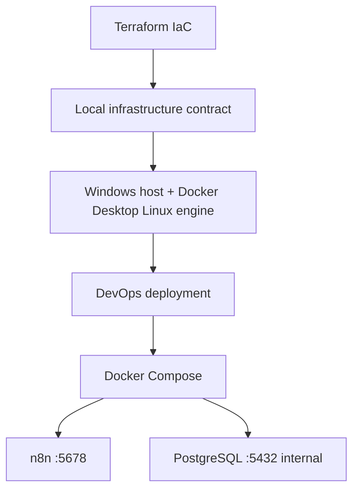

# SIOSE Local Infrastructure

**Owner:** Faisal (Infrastructure / Terraform / environment validation)  
**Project:** SIOSE — Smart Internal Operations & Support Escalation Platform  
**Team:** NEX

## Overview

This folder is the **infrastructure layer** for a local laptop demo.

Terraform records infrastructure requirements as code and writes a non-secret handoff file for DevOps. It does **not** start n8n or PostgreSQL.

Azure, AWS, GCP, Kubernetes, and cloud VMs are not used.

```text
NOT APPLICABLE — Local deployment selected by team
```

## Architecture



```text
User
 │
 ▼
localhost (127.0.0.1)
 │
 ▼
Host port 5678  (or 5679 if 5678 is busy)
 │
 ▼
Docker Compose          ← Rahaf
 ├──── n8n :5678
 │
 └──── PostgreSQL :5432
          │
          └── Docker internal network only
```

Terraform and Docker Compose are different layers:

| Layer | Tool | Owner | Job |
|-------|------|-------|-----|
| Infrastructure | Terraform + validation scripts | Faisal | Requirements, ports, security rules, handoff JSON |
| Deployment | Docker Compose + Bash | Rahaf | Run n8n and PostgreSQL |

## Responsibility Separation

Faisal (this folder):

- Terraform structure
- Local environment definition
- Host validation
- Networking and security requirements
- Infrastructure evidence
- Infrastructure-to-DevOps handoff

Rahaf (not in this folder):

- Docker install/config
- Docker Compose
- n8n and PostgreSQL containers
- `.env` generation
- start/stop/health/cleanup scripts

Do not convert Compose services into Terraform `docker_container` resources.

## Local Environment

Validated execution model on Faisal’s machine (Phase 2):

- Windows 10 Home 22H2
- Docker Desktop Linux engine
- WSL2 Ubuntu available (Docker CLI inside Ubuntu was not enabled; not required)
- Git Bash available for `.sh` scripts

Use Windows PowerShell for Terraform and `check-infrastructure.ps1`.

## Terraform

Path: `infrastructure/terraform/`

Provider used: `hashicorp/local` (writes `infrastructure/generated/infrastructure-handoff.json`).

Providers **not** used: Azure, AWS, GCP, Kubernetes, Docker.

See [terraform/README.md](terraform/README.md).

## Networking

| Service | Internal port | Host publish | Bind |
|---------|---------------|--------------|------|
| n8n | 5678 | 5678:5678 preferred | `127.0.0.1` (local only) |
| PostgreSQL | 5432 | **none** | Docker network only |

If host port 5678 is occupied, DevOps should map `5679:5678` and Faisal should set `n8n_host_port = 5679` in `terraform.tfvars`, then re-apply. Terraform must not edit Compose files.

A process already using host **5432** is not a reason to publish Docker PostgreSQL. Compose must still omit `ports:` for Postgres.

## Security

### n8n

- Local access by default (`127.0.0.1`)
- Do not expose the UI on the public internet
- HTTP is acceptable for this local bootcamp demo

### PostgreSQL

- Port 5432 is not published
- n8n reaches Postgres by Docker service name on the internal network

### Secrets

Never commit:

- `.env`
- `terraform.tfvars`
- `*.tfstate` / `*.tfstate.*`
- private keys
- passwords
- API tokens
- n8n encryption keys

Root `.gitignore` blocks these patterns.

## Infrastructure Validation

Windows (primary):

```powershell
powershell -ExecutionPolicy Bypass -File C:\n8n\infrastructure\scripts\check-infrastructure.ps1
```

Linux / WSL (optional):

```bash
chmod +x infrastructure/scripts/check-infrastructure.sh
./infrastructure/scripts/check-infrastructure.sh
```

Output uses `[PASS]`, `[WARNING]`, and `[FAIL]`.

The scripts never install Docker, never run Compose, and never kill processes.

## Running Terraform

```powershell
cd C:\n8n\infrastructure\terraform
terraform fmt
terraform init
terraform validate
terraform plan
terraform apply
terraform plan
```

The second plan is the idempotency check.

Do not run `terraform destroy` unless Faisal explicitly requests it.

## Evidence

See [evidence/README.md](evidence/README.md) for the screenshot list.

## DevOps Handoff

After `terraform apply`, give Rahaf:

- `infrastructure/generated/infrastructure-handoff.json`
- `terraform output`
- Validation script result
- Port occupancy (5678 / 5432)

Rahaf should start the stack with Compose using those ports. Faisal does not start containers.

Azure-specific handoff fields:

```text
NOT APPLICABLE — Local deployment selected by team
```

## Troubleshooting

| Symptom | What to do |
|---------|------------|
| `terraform` not recognized | Open a new terminal; confirm `terraform version` |
| `terraform init` fails | Check HTTPS to `registry.terraform.io`; retry on campus Wi-Fi |
| Docker FAIL in validation | Start Docker Desktop and wait until it is idle, then rerun the script |
| Port 5678 WARNING | Ask Rahaf for `5679:5678`. Update `n8n_host_port` and re-apply Terraform. Do not kill the other process from these scripts |
| Port 5432 WARNING | Host Postgres is fine. Compose must still keep Postgres unpublished |
| WSL has no `docker` | Expected if Ubuntu integration is off. Use Docker Desktop from PowerShell |

## Known Limitations

- This is a bootcamp local demo, not production.
- Terraform cannot provision a Linux VM on the laptop without overlapping DevOps. It only records requirements and writes metadata.
- Docker Desktop WSL integration for Ubuntu may be off; the Windows Docker CLI is the supported path.
- Host port 5432 may already be used by a local Postgres install. That does not authorize publishing Compose Postgres.
- Existing team GitHub Compose on `Faisalbranch` currently maps **5679:5678**. This infrastructure contract prefers **5678:5678** when that port is free. Confirm with Rahaf before the demo.
- This `C:\n8n` tree is Faisal’s infrastructure work only. It is not a clone of the GitHub repo. Copy/push onto `Faisalbranch` later if the team wants it in GitHub.
